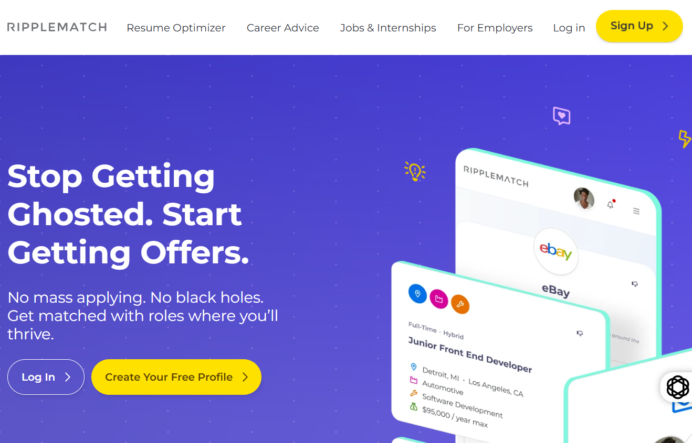

# ResumeAI - AI-Powered Resume Scanner & Job Matching Platform

[](https://opensource.org/licenses/MIT)
[](https://aws.amazon.com/)
[](https://reactjs.org/)
[](https://nodejs.org/)

## 📋 Project Requirements

ResumeAI is a full-stack web application designed to solve the modern job search challenge by automatically matching candidates with relevant job opportunities based on their resume content. The system was built to meet the following requirements:

### Core Requirements

1. **Resume Upload & Parsing**
   - Accept PDF resume uploads from authenticated users
   - Parse resume content to extract skills, experience, and qualifications
   - Store parsed data in a relational database for future matching

2. **Intelligent Job Matching**
   - Compare resume content against available job descriptions
   - Calculate percentage-based match scores using AI algorithms
   - Rank and display top matching opportunities for each candidate

3. **User Authentication & Security**
   - Secure user registration and login system
   - Protected API endpoints with JWT token authentication
   - User-specific resume storage and match history

4. **Scalable Cloud Infrastructure**
   - Serverless architecture to handle variable load
   - High availability with multi-AZ database deployment
   - Cost-effective pay-per-use model for compute resources

5. **Interactive User Interface**
   - Modern, responsive web application
   - Real-time feedback during resume upload and processing
   - Dashboard to view match scores and job details

## 🔄 System Architecture & Data Flow

The application follows a serverless microservices architecture on AWS, with data flowing through the following stages:

### Data Flow Diagram

```
┌─────────────┐
│   User's    │
│   Browser   │
│  (React.js) │
└──────┬──────┘
       │
       │ 1. User uploads PDF resume
       │
       ▼
┌─────────────────────────────────────┐
│     AWS API Gateway (REST API)      │
│  - Authenticates via Cognito JWT    │
│  - Routes requests to Lambda        │
└──────────┬──────────────────────────┘
           │
           │ 2. Invokes Lambda function
           │
           ▼
┌──────────────────────────────────────┐
│      AWS Lambda: uploadResume        │
│  - Generates presigned S3 URL        │
│  - Returns upload URL to client      │
└──────────┬───────────────────────────┘
           │
           │ 3. Client uploads file to S3
           │
           ▼
┌──────────────────────────────────────┐
│         AWS S3 Bucket                │
│  - Stores resume PDF files           │
│  - Bucket: elvin-resumeai-api        │
└──────────┬───────────────────────────┘
           │
           │ 4. Lambda parses resume
           │
           ▼
┌──────────────────────────────────────┐
│    AWS Lambda: parse-resume          │
│  - Downloads file from S3            │
│  - Extracts text from PDF            │
│  - Parses skills & experience        │
│  - Stores in database                │
└──────────┬───────────────────────────┘
           │
           │ 5. Saves parsed data
           │
           ▼
┌──────────────────────────────────────┐
│   AWS RDS Aurora (PostgreSQL)        │
│  - Stores resume content             │
│  - Stores job descriptions           │
│  - Multi-AZ for high availability    │
└──────────┬───────────────────────────┘
           │
           │ 6. Triggers job matching
           │
           ▼
┌──────────────────────────────────────┐
│  AWS Lambda: resume-match-all-jobs   │
│  - Retrieves all job descriptions    │
│  - Compares with resume content      │
│  - Calculates match percentages      │
│  - Returns ranked job matches        │
└──────────┬───────────────────────────┘
           │
           │ 7. Returns results to client
           │
           ▼
┌──────────────────────────────────────┐
│       User Dashboard (React)         │
│  - Displays job matches              │
│  - Shows match percentages           │
│  - Provides match explanations       │
└──────────────────────────────────────┘
```

### Key Components

- **Frontend**: React.js single-page application with responsive design
- **API Gateway**: RESTful API with 6 resources and Lambda proxy integration
- **Compute**: 7 Lambda functions handling different operations (Node.js 22.x/24.x)
- **Database**: RDS Aurora PostgreSQL with multi-AZ deployment
- **Storage**: S3 bucket for resume PDF files
- **Authentication**: AWS Cognito user pools with 23+ registered users
- **Networking**: VPC with public/private subnets and Internet Gateway

## 📸 Application Interface

The image below shows the landing page of the ResumeAI application, demonstrating the user-facing interface and core value proposition:



### What This Screenshot Shows

This landing page demonstrates several key aspects of the application:

1. **Clean, Professional Design**: The interface uses a modern, purple-themed design that is visually appealing and professional, making a strong first impression for job seekers.

2. **Clear Value Proposition**: The headline "Stop Getting Ghosted. Start Getting Offers" immediately communicates the problem the application solves - helping candidates get matched with jobs instead of being ignored.

3. **User-Friendly Navigation**: The top navigation bar provides easy access to key features:
   - Resume Optimizer - for improving resume content
   - Career Advice - for guidance and tips
   - Jobs & Internships - for browsing opportunities
   - For Employers - separate portal for companies
   - Sign Up/Log In - authentication entry points

4. **Job Matching Preview**: The right side shows a preview of the matching interface, displaying:
   - Company logos (eBay example)
   - Job titles ("Junior Front End Developer")
   - Location information (Detroit, MI / Los Angeles, CA)
   - Job type (Full-Time, Hybrid)
   - Salary range ($95,000/year Max)
   - Industry tags (Automotive, Software Development)

5. **Call-to-Action Buttons**: Two prominent CTAs encourage user engagement:
   - "Log In" - for returning users
   - "Create Your Free Profile" - for new user acquisition

### Technical Implementation

The landing page is built using:
- **React.js** for component-based UI
- **Tailwind CSS** for responsive styling
- **Framer Motion** for smooth animations
- **Lucide React** icons for visual elements
- Hosted on AWS with CloudFront CDN for fast global delivery

When a user clicks "Sign Up" or "Log In", they are authenticated through AWS Cognito, which manages user pools and provides secure JWT tokens for API access. Once authenticated, users can upload their resume and receive AI-powered job matches based on their skills and experience.

## 🛠️ Technology Stack

### Frontend
- React.js 19.2.0
- JavaScript (ES6+)
- Tailwind CSS 3.4.1
- Framer Motion 12.23.26
- Lucide React 0.553.0

### Backend
- Node.js 22.x/24.x
- AWS Lambda (serverless functions)
- AWS API Gateway (REST API)

### Database & Storage
- AWS RDS Aurora (PostgreSQL)
- AWS S3 (resume file storage)

### Authentication
- AWS Cognito (user pools)
- JWT tokens

### Infrastructure
- AWS VPC with public/private subnets
- AWS Internet Gateway
- AWS CloudWatch (monitoring)

## 🚀 Getting Started

### Prerequisites

```bash
- Node.js (v22.x or higher, matching Lambda runtime)
- npm (v8 or higher) or yarn
- Git
- AWS Account (for deployment)
- AWS CLI (configured with credentials)
```

### Local Development Setup

1. **Clone the repository**

```bash
git clone https://github.com/elvinhatamov/resume-scanner-application.git
cd resume-scanner-application
```

2. **Install dependencies**

```bash
npm install
```

3. **Configure environment variables**

Create a `.env` file in the project root (see `.env.example` for template):

```env
REACT_APP_API_URL=your-api-gateway-url
REACT_APP_COGNITO_USER_POOL_ID=your-cognito-pool-id
REACT_APP_COGNITO_CLIENT_ID=your-cognito-client-id
REACT_APP_AWS_REGION=us-east-1
```

4. **Start the development server**

```bash
npm start
```

5. **Open your browser at** [http://localhost:3000](http://localhost:3000)

### Available Scripts

- `npm start` - Run development server
- `npm test` - Run tests
- `npm run build` - Build for production

## 📡 API Endpoints

The application uses the following REST API endpoints:

| Method | Endpoint | Description |
|--------|----------|-------------|
| POST | `/upload` | Generate presigned URL for resume upload |
| POST | `/parse-resume` | Parse uploaded resume content |
| POST | `/match-all` | Match resume against all jobs |
| POST | `/job-matching` | Match resume with specific job |
| GET | `/get-resumes` | Retrieve user's resumes |
| POST | `/import-jobs` | Import job descriptions |

All endpoints require authentication via JWT token in the `Authorization` header.

## 🤝 Contributing

Contributions are welcome! Please follow these steps:

1. Fork the project
2. Create your feature branch (`git checkout -b feature/AmazingFeature`)
3. Commit your changes (`git commit -m 'Add some AmazingFeature'`)
4. Push to the branch (`git push origin feature/AmazingFeature`)
5. Open a Pull Request

## 📄 License

This project is licensed under the MIT License - see the [LICENSE](LICENSE) file for details.

## 👨‍💻 Author

**Elvin Hatamov**

- GitHub: [@elvinhatamov](https://github.com/elvinhatamov)
- LinkedIn: [Connect with me](https://www.linkedin.com/in/elvinhatamov)

---

⭐ **Star this repository if you find it helpful!**

Made with ❤️ and ☕ by Elvin Hatamov

*Built with React, AWS Lambda, and a passion for connecting talent with opportunities*
